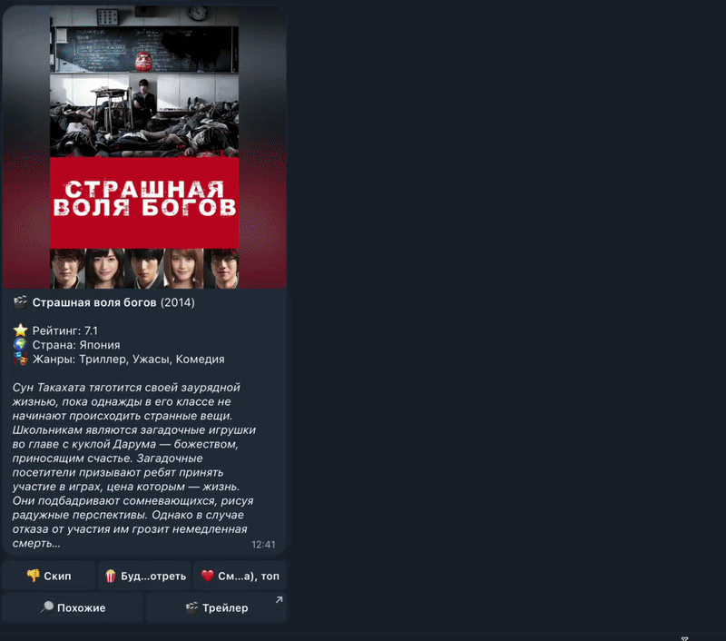

# KinoCompass


Telegram-бот с ML-движком для персональных рекомендаций фильмов, построенный на базе архитектуры **Two-Stage RecSys (Retrieval + Ranking)**.




## Архитектура системы
* **Stage 1 (Retrieval):** Высокоскоростной микросервис на C++ для поиска ближайших соседей (kNN). Использует эмбеддинги, сгенерированные из названий, описаний и жанров фильмов (`Hugging Face multilingual-e5-small`), для точного семантического отбора кандидатов.
* **Stage 2 (Ranking):** Модель машинного обучения CatBoost (Python). Принимает кандидатов от C++ сервера и ранжирует их, анализируя историю взаимодействий пользователя, динамические предпочтения и контекстные признаки.
* **Хранилище:** PostgreSQL для записи логов взаимодействий и хранения каталога фильмов (с поддержкой обновления данных через механизм Upsert).

## Ключевые ML-решения и функциональность

* **Кластеризация для Cold-start:** Векторное пространство фильмов предварительно кластеризовано алгоритмом K-Means для отбора репрезентативных центроидов. Это обеспечивает сбалансированный сбор первичного профиля у новых пользователей.
* **Непрерывный семантический поиск (Режим «Похожие»):** Изолированный флоу **Item-to-Item (I2I)**, обходящий этап персонального ранжирования. Логика опирается на прямые запросы к C++ микросервису для извлечения kNN-соседей. Каждая итерация выдачи рассчитывается как ближайший сосед предыдущего фильма, формируя интуитивный контентный дрейф и решая проблему информационного пузыря (Filter Bubble).
* **Умная лента рекомендаций:** Алгоритм адаптируется под пользователя с применением механизма экспоненциального затухания (Time Decay) для исторических взаимодействий.
* **Управление состояниями:** Навигация между лентой рекомендаций и списком закладок (с поддержкой пагинации) реализована через управление FSM-состояниями в Aiogram.

## Обучение модели и Валидация

* **Защита от Target Leakage:** Пайплайн подготовки данных применяет строгую хронологическую сортировку и сдвиг оконных функций (time-shift) в Pandas при расчете динамических пользовательских признаков.
* **Метрика оценки:** В связи с естественным дисбалансом классов (преобладание пропусков над позитивными взаимодействиями) для оценки качества ранжирования выбрана метрика **PR-AUC**.
* **Двухуровневая валидация:** Применена схема **Leave-One-User-Out (LOUO)** для оценки обобщающей способности на новых пользователях и **Out-of-Time (Temporal Split)** для валидации на исторических данных без «заглядывания в будущее».

**Результаты оценки:** 
На общей выборке PR-AUC составил **0.38** (при базовой вероятности случайного угадывания 0.25). При предсказании интересов активной когорты пользователей (накопивших более 15 взаимодействий) метрика достигает **0.60**, что подтверждает высокую точность персонализации при наличии истории.

## Структура проекта

```text
├── notebooks/             # Разведочный анализ и подготовка данных
│   ├── clustering.ipynb
│   ├── embeddings.ipynb
│   └── parsing.ipynb
├── src/
│   ├── bot/               # Telegram-бот (Aiogram) и логика БД
│   │   ├── database/      # Модели, движок SQLAlchemy и загрузчики
│   │   ├── Dockerfile
│   │   ├── keyboards.py
│   │   ├── main.py
│   │   ├── requirements.txt
│   │   └── services.py
│   ├── recsys/            # Код инференса и обучения CatBoost
│   │   └── train.ipynb
│   └── server/            # C++ микросервис (kNN-индекс, HTTP-сервер)
│       ├── src/           # Исходные файлы C++ (knn_engine, matrix, httplib)
│       ├── CMakeLists.txt
│       └── Dockerfile
├── .env.example
├── .gitignore
└── docker-compose.yml
```

## Воспроизводимость

Для воспроизведения процесса генерации эмбеддингов, расчета фичей и обучения CatBoost с нуля:
1. Поместите исходный датасет взаимодействий и метаданных в директорию `data/`.
2. Перейдите в папку `notebooks/` и выполните разведочный анализ и подготовку данных, последовательно запустив:
   * `parsing.ipynb`
   * `embeddings.ipynb`
   * `clustering.ipynb`
3. Запустите процесс обучения и валидации (OOT/LOUO) ранжирующей модели в ноутбуке `src/recsys/train.ipynb`.

## Развертывание

Проект полностью контейнеризирован и готов к запуску через Docker Compose.

1. Склонируйте репозиторий:
   ```bash
   git clone [https://github.com/your-username/movie_bot.git](https://github.com/your-username/movie_bot.git)
   cd movie_bot
   ```

2. Создайте файл `.env` в корневой директории, скопировав структуру из `.env.example`, и заполните своими данными:
   ```env
   BOT_TOKEN=your_telegram_bot_token_here
   TMDB_API_KEY=your_tmdb_api_key_here

   CPP_SERVER_HOST=127.0.0.1
   CPP_SERVER_PORT=8080

   DB_USER=postgres
   DB_PASSWORD=your_database_password_here
   DB_NAME=kinocompass
   DB_HOST=db
   DB_PORT=5432
   ```

3. Разместите файл обученной модели (например, `recsys_prod.cbm`) и сгенерированные бинарные индексы в директории `data/`.

4. Запустите инфраструктуру (БД, C++ микросервис и Python-бота):
   ```bash
   docker compose up -d --build
   ```